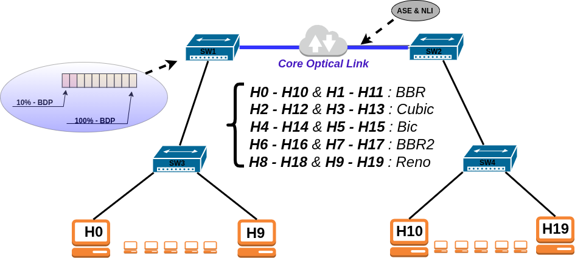

# On the Interplay of Congestion and OSNR Degradation for TCP over Optical Networks

**Abstract**—This work investigates transmission control protocol (TCP) performance over optical networks, highlighting the
interplay of physical layer effects and congestion caused by buffer overflow at intermediate nodes on different congestion
control mechanisms. In optical networks packet dropping will happen due to optical signal-to noise ratio (OSNR) degradation
due to amplified spontaneous emission (ASE) and nonlinear effects (NLI) in fiber affecting differently congestion control
algorithms (CCAs) employed by TCP. This study also aims to evaluate the bandwidth competition behavior of TCP CCAs
in congestion (i.e, buffer overflows) and discard due to bit error rate caused by OSNR degradation. Experiments were
conducted using Mininet-Optical, along with Linux tc and iperf3, to emulate real world conditions. The degradation of
OSNR level to 19.45, 19.15 and 18.95 dB, causing approximately 0.2, 0.5 and 0.8% of packet losses, seems to have a positive
impact on fairness by avoiding self-synchronization and slow convergence of competing CCAs-based flows. This may indicate
that stringent signal quality requirements can be relaxed in forthcoming IPoDWDM consolidation of optical and packet
networks.

**Index Terms** — *Congestion Control Algorithms, Physical Layer Impairments, Optical Networks.*

